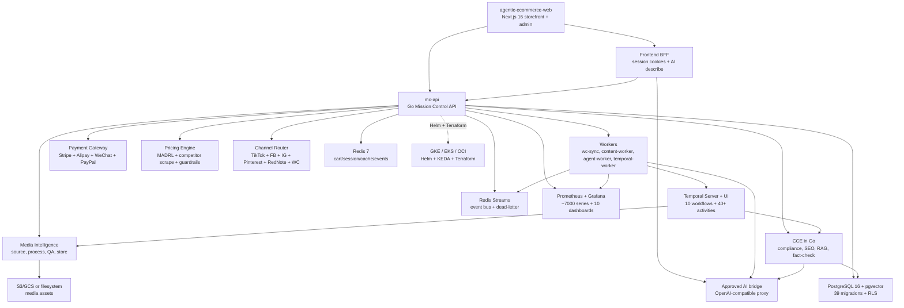

# Agentic Ecommerce

[](https://github.com/nfsarch33/agentic-ecommerce/actions/workflows/ci.yml)

[](LICENSE)

Production-ready agentic e-commerce platform with multi-channel selling, AI-driven pricing, 4-provider payment gateway, cloud-native K8s deployment, GDPR compliance, and MADRL agent coordination.

Current release: **v9.0.0**. See `VERSION`, `CHANGELOG.md`, and `docs/release-checklist.md` for release gates.

## Features

- **Multi-channel selling** -- TikTok Shop, Facebook, Instagram, Pinterest, RedNote, WooCommerce with unified listing, order, and inventory sync across all 6 channels
- **4-provider payment gateway** -- Stripe, Alipay, WeChat Pay, PayPal with Temporal saga orchestration, webhook normalisation, and AI payment advisor
- **AI-driven pricing** -- competitor price scraping, dynamic pricing agent with margin guardrails, MADRL multi-agent coordination for pricing vs fulfilment conflict resolution
- **China sourcing pipeline** -- 1688 + Taobao adapters, supplier scoring, AU-import compliance gate, trend-signal blending via pgvector
- **AI product enrichment** -- multilingual description generation, hero image processing, SEO optimisation, content calendar with EMA feedback loop
- **Customer service automation** -- bilingual enquiry classifier, FAQ auto-responder, multi-channel messaging adapters
- **Marketplace ecosystem** -- vendor onboarding, commission engine, payout tracking, Plugin SDK for third-party developers
- **Cloud-native deployment** -- GKE Autopilot, EKS, OCI with Helm charts, KEDA autoscaling, Terraform IaC, multi-cloud DR
- **GDPR/CCPA compliance** -- data residency controls, right-to-delete workflows, consent management, audit logging, data export
- **Observability** -- OpenTelemetry tracing, ~7000 Prometheus series, 10+ Grafana dashboards, Agentrace EvoMap integration
- **OOM prevention** -- adaptive worker pools, RSS-based backpressure, circuit breakers on all external calls, phased drain
- **Logistics + returns** -- carrier label adapters, 3-channel status propagation, returns saga with auto-approval threshold, ROI heatmap
- **Onboarding wizard** -- 4-step AI-guided tenant setup with channel pre-flight checks

## Architecture



The platform runs 8 production binaries: `mc-api`, `wc-sync`, `content-worker`, `agent-worker`, `temporal-worker`, `uiauto-compare`, `ec-cli`, `evomap-rollup`. The database schema spans 39 numbered migrations (`0001` through `0039`) with row-level security on all tenant-keyed tables.

## Tech Stack

| Layer | Technology |
|-------|-----------|
| Backend | Go 1.26.3, Clean Architecture |
| Frontend | Next.js 16.2.6, React 19, TypeScript strict |
| Database | PostgreSQL 16 + pgvector |
| Cache/Events | Redis 7 (Streams + pub/sub) |
| Workflows | Temporal (10 workflows, 40+ activities) |
| Observability | OpenTelemetry, Prometheus, Grafana |
| Payments | Stripe, Alipay, WeChat Pay, PayPal |
| Cloud | GKE Autopilot, EKS, OCI, Terraform, Helm, KEDA |
| CI/CD | GitHub Actions, Docker (distroless) |

## Getting Started

### Docker Compose quickstart

```bash
cp .env.example .env
make dev
curl http://127.0.0.1:8080/healthz
curl http://127.0.0.1:8080/readyz
```

The stack runs PostgreSQL + pgvector, Redis 7, and `mc-api` with ports bound to `127.0.0.1`. Profiles gate optional services (workers, Temporal, n8n) so they do not make live external calls by default.

### Full stack compose

```bash
cp .env.compose.example .env.compose
docker compose --env-file .env.compose -f docker-compose.yml up -d --build
curl http://127.0.0.1:8080/healthz
curl http://127.0.0.1:8080/metrics
```

Includes `mc-api`, frontend, PostgreSQL, Redis, Prometheus, Grafana, Temporal, and n8n.

### Helm deployment (GKE/EKS/OCI)

```bash
helm upgrade --install ec deploy/helm/agentic-ecommerce \
  --namespace ecommerce --create-namespace \
  -f deploy/helm/agentic-ecommerce/values-gke.yaml
```

See `deploy/terraform/` for cloud-specific Terraform modules (GKE, EKS, OCI, DR, shared modules).

### ec-cli developer tool

```bash
ec-cli doctor                              # environment diagnostics
ec-cli tenant create --slug demo --plan starter  # provision a tenant
ec-cli plugin validate --path ./my-plugin  # validate a marketplace plugin
```

## API Documentation

- Backend OpenAPI contract: `api/openapi.yaml`
- API capability guide: `docs/api-reference.md`
- Temporal workflow specs: `docs/temporal-workflow-specs.md`
- Webhook contracts: `docs/webhook-contracts.md`
- Cloud deployment guide: `docs/cloud-deploy.md`
- Demo walkthrough: `docs/demo/v500-demo-script.md`

## Quality Gates

```bash
go test -race ./...
go vet ./...
make build
make coverage-check          # >= 83% backend coverage
make monitoring-validate
make release-perf-smoke
sentrux gate .               # complex_fn=4 hard gate
```

## Public Safety

This repository is Apache-2.0 and safe for public collaboration only while it contains generic source, tests, documentation, and placeholder configuration. Do not commit live credentials, browser profiles, private fleet hostnames, internal IPs, or local `.env` files. See `SECURITY.md`.

The public Next.js frontend lives at `nfsarch33/agentic-ecommerce-web` and consumes the API contract in `api/openapi.yaml`.
