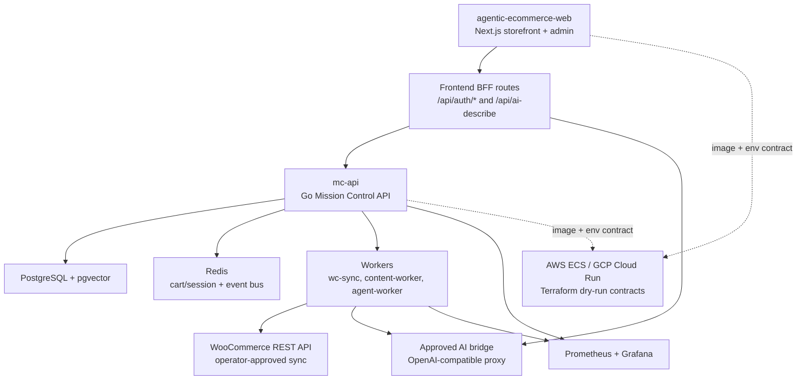

# Agentic Ecommerce

Standalone Go service stack for WooCommerce-first agentic ecommerce.

Current release: **v1.0.0**. See `VERSION`, `CHANGELOG.md`, and `docs/release-checklist.md` for release gates.

## Scope

- Mission Control API spine (`cmd/mc-api`)
- WooCommerce sync worker (`cmd/wc-sync`)
- Content and compliance worker (`cmd/content-worker`)
- Clean Architecture packages under `internal/domain`, `internal/port`, `internal/app`, and `internal/adapter`

This repo starts with WooCommerce cashflow first, then grows into multi-channel catalog, content compliance, Temporal workflows, n8n event automation, and media intelligence.

## Architecture



`api/openapi.yaml` is the source of truth for the backend API consumed by the frontend. Public platform endpoints are `/healthz`, `/readyz`, and `/metrics`; storefront product reads, cart operations, and checkout order creation remain public, while admin/operator mutations require JWT bearer tokens and RBAC.

## Public Safety

This repository is Apache-2.0 and safe for public collaboration only while it contains generic source, tests, documentation, and placeholder configuration. Do not commit live WooCommerce credentials, MiniMax keys, browser profiles, private fleet hostnames, internal IPs, or local `.env` files. See `SECURITY.md`.

The public Next.js frontend lives at `nfsarch33/agentic-ecommerce-web` and consumes the API contract in `api/openapi.yaml`.

## Quickstart

Use the dev compose stack for backend work:

```bash
cp .env.example .env
make dev
curl http://127.0.0.1:8080/healthz
curl http://127.0.0.1:8080/readyz
make redis-ping
```

The stack runs PostgreSQL, Redis 7, and `mc-api` with published ports bound to `127.0.0.1` by default. `/healthz` is a liveness check only. `/readyz` gates configured dependencies by pinging `ECOMMERCE_DB_URL` and `ECOMMERCE_REDIS_ADDR`; unset dependencies are reported as skipped so local in-memory tests stay lightweight. Redis is exposed to `mc-api` as `ECOMMERCE_REDIS_ADDR=redis:6379`; host tools can use `ECOMMERCE_REDIS_ADDR=127.0.0.1:6379`.

PostgreSQL uses the `pgvector/pgvector:pg16` image in both compose files. For
v1.3.0 RAG infra work, apply deterministic fixtures and validate vector search
without live embedding calls:

```bash
make rag-seed
make rag-search-smoke
```

Embedding generation is bridge-only. Configure
`ECOMMERCE_EMBEDDING_BRIDGE_URL`, `ECOMMERCE_EMBEDDING_MODEL`,
`ECOMMERCE_EMBEDDING_DIMENSIONS`, and `ECOMMERCE_RAG_CHUNK_SIZE` when the
approved fleet bridge embedding endpoint is available; do not point app
containers directly at MiniMax.

Protected backend operations use JWT bearer tokens with RBAC roles `admin`, `operator`, and `viewer`. Configure `ECOMMERCE_JWT_SECRET`, `ECOMMERCE_ADMIN_USERNAME`, and `ECOMMERCE_ADMIN_PASSWORD` locally, then call `/api/v1/auth/login` for a short-lived access token. Health, readiness, metrics, storefront product reads, cart operations, and checkout order creation remain public.

For the storefront checkout flow, run `agentic-ecommerce-web` separately with `bun run dev` and point it at `http://127.0.0.1:8080`. See `docs/local-development.md` for the backend compose, frontend dev, and Redis readiness plan.

## API Documentation

- Backend OpenAPI contract: `api/openapi.yaml`.
- Local API root: `http://127.0.0.1:8080` after `make dev`.
- Frontend BFF route documentation: `agentic-ecommerce-web/docs/bff-routes.md`.

Regenerate frontend API types from this contract in the frontend repo with `bun run api:generate` after backend contract changes.

## Full Stack Compose

v0.5.0 adds a production-like compose stack for local single-host validation:

```bash
cp .env.compose.example .env.compose
docker compose --env-file .env.compose -f docker-compose.yml config
docker compose --env-file .env.compose -f docker-compose.yml up -d --build
curl http://127.0.0.1:8080/healthz
curl http://127.0.0.1:8080/readyz
curl http://127.0.0.1:8080/metrics
```

The stack includes `mc-api`, the public `agentic-ecommerce-web` image, PostgreSQL + pgvector, Redis, Prometheus, and Grafana. `mc-api` emits JSON access logs with `request_id`, mirrors `X-Request-ID` on responses, and can enable lightweight OpenTelemetry HTTP spans with `ECOMMERCE_OTEL_ENABLED=true`. Scaffolded `wc-sync`, `content-worker`, and the optional `minimax-openai-bridge` placeholder are behind compose profiles so they do not make live WooCommerce or MiniMax calls by default. See `docs/full-stack-compose.md` for profiles, dashboard URLs, and security boundaries.

The optional WooCommerce dev profile adds WordPress, MariaDB, a WP-CLI helper, and the `wc-sync` worker:

```bash
make wc-up
make sync-once
make wc-down
```

WooCommerce plugin installation and REST API key creation are explicit local steps, not automatic boot actions. See `docs/dev-compose.md` for the full local WooCommerce flow and the Redis event bus channel contract.

## Cloud Deployment

The v1.0.0 release keeps Docker Compose as the deploy-contract source of truth and provides credential-free Terraform scaffolding for AWS ECS Fargate and GCP Cloud Run under `deploy/terraform/`. See `docs/cloud-deploy.md` for SHA-tagged image promotion, secret-manager mapping, Docker Compose references, database migration workflow, security boundaries, and cloud observability notes.

## Gates

```bash
go test -race ./...
go vet ./...
make build
go test -race -coverprofile=coverage.out ./...
go tool cover -func=coverage.out
make monitoring-validate
make release-perf-smoke
```

`make release-perf-smoke` runs the v1.0.0 API smoke against an in-process
deterministic mc-api with in-memory repositories, JWT login, and a mocked
content agent. It verifies p95 latency targets for `GET /api/v1/products`,
admin login, and mocked AI description generation without MiniMax or
WooCommerce network calls.

Private-repo operations must go through `runx` once the `ecommerce` alias is registered.
